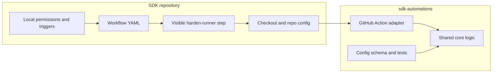
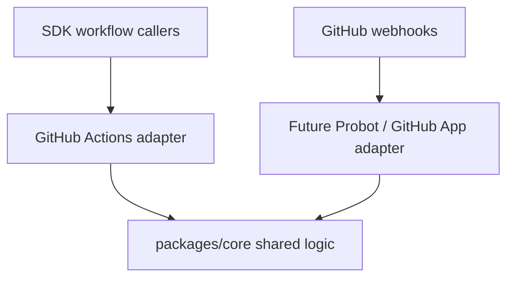
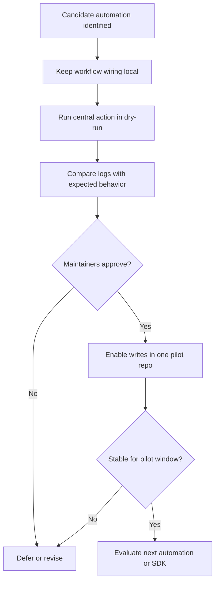

# Phased Migration Plan for Shared SDK Automations

Last updated: 2026-05-13

Status: strategy draft for maintainer review

Related work:

- LFDT mentorship project: https://github.com/LF-Decentralized-Trust-Mentorships/mentorship-program/issues/73
- C++ investigation issue: https://github.com/hiero-ledger/hiero-sdk-cpp/issues/1627
- Central automation candidate repo: https://github.com/darshit2308/sdk-automations
- Python canary fork: https://github.com/darshit2308/hiero-sdk-python
- Central repo CI proof: https://github.com/darshit2308/sdk-automations/actions/runs/25763437710
- Python fork canary proof: https://github.com/darshit2308/hiero-sdk-python/actions/runs/25763950499/job/75671903429

## Executive Summary

The migration strategy is deliberately phased. The goal is not to move every SDK workflow into one central wrapper at once. The goal is to centralize reusable automation logic while preserving the parts of each SDK workflow that are security-sensitive, repository-specific, and easier for maintainers to audit locally.

The recommended direction is:

1. Prove the shared action model with Python `review-sync` first.
2. Keep SDK workflow YAML local for triggers, permissions, checkout, concurrency, artifacts, and harden-runner.
3. Move reusable logic into `sdk-automations` as tested core modules and thin GitHub Action adapters.
4. Use dry-run and fork canaries before enabling writes upstream.
5. Revisit C++ only after the shared interface is stable, because C++ workflows are contributor-facing and have already gone through recent structural refactoring.
6. Add Probot or a GitHub App later as an adapter over the same shared core, not as the first migration dependency.

The core principle is:

> Centralize reusable automation logic gradually, while keeping SDK workflow ownership, permissions, checkout, harden-runner, and repo policy local until each automation is proven.

This plan intentionally avoids a big-bang migration. It gives maintainers clear review points, rollback paths, and evidence at every phase.

## Why This Is Not A Big-Bang Migration

A broad migration would look impressive on paper, but it would be risky in practice. The current ecosystem has different workflow shapes, different repository maturity levels, and different amounts of local automation logic.

A phased migration is safer because it lets maintainers answer one question at a time:

- Can an SDK repo call a central action without losing local workflow control?
- Can the action load repo-local config correctly?
- Can it run safely in dry-run mode?
- Can it mutate only a fork or controlled pilot before production?
- Can the central core be tested independently of GitHub Actions globals?
- Can rollback stay simple?
- Can C++ be evaluated without disrupting its existing contributor-facing bot behavior?

The first proof should be small and real, not large and speculative. Python `review-sync` is the best first candidate because it is bounded, already related to review queue automation, and lower risk than assignment logic.

## Current Evidence

### Central repo proof

The candidate central repository is:

https://github.com/darshit2308/sdk-automations

Current structure includes:

- `packages/core`: shared automation logic.
- `packages/github-action-adapter`: GitHub Actions input/client boundary.
- `actions/review-sync`: callable review-sync JavaScript action.
- `actions/run-automation`: generic dispatcher action.
- `schemas/hiero-automation.schema.json`: repo config schema.
- `examples/`: caller examples for SDK repositories.
- `docs/`: architecture, caller interface, StepSecurity notes, and migration docs.

The central repo has CI that runs tests, builds action bundles, and verifies that committed `actions/*/dist/index.js` bundles are current:

https://github.com/darshit2308/sdk-automations/actions/runs/25763437710

The large `dist/index.js` files are generated GitHub Action bundles, not hand-written source. They are committed so SDK caller repositories can use the action without installing this repo's workspace dependencies.

### Python canary proof

The Python fork canary is:

https://github.com/darshit2308/hiero-sdk-python

The canary adds only:

- `.github/hiero-automation.yml`
- `.github/workflows/central-review-sync-canary.yml`

The canary proves that an SDK repository can keep workflow ownership local while calling reusable logic from the central repo.

The workflow keeps these pieces in the Python SDK fork:

- `workflow_dispatch` trigger
- `permissions`
- `step-security/harden-runner`
- checkout
- config file path
- token choice
- dry-run/write mode choice

A successful fork run proved the central action can execute end-to-end and apply the expected review labels in the fork:

https://github.com/darshit2308/hiero-sdk-python/actions/runs/25763950499/job/75671903429

The current canary workflow is set back to `dry-run: true` for the safer steady state. This separates two useful proofs:

- Fork mutation proof: the central action can write labels in a controlled fork.
- Safe canary state: the branch can remain reviewable without mutating upstream production state.

### C++ investigation status

The C++ issue is intentionally scoped as an investigation, not a production workflow refactor:

https://github.com/hiero-ledger/hiero-sdk-cpp/issues/1627

The issue asks for:

- target automation prototype identification
- caller interface definition
- StepSecurity impact analysis
- simple C++ workflow before/after
- awkward C++ workflow before/after
- final recommendation
- no production workflow behavior changes as part of the investigation

This plan aligns with that scope by recommending central action/core extraction first and C++ workflow changes later.

## Repository Landscape

The Hiero SDK ecosystem does not have one uniform automation shape. Some SDKs mostly have build/release workflows. Python and C++ have much larger local automation surfaces.

The following matrix was sampled from public GitHub repository trees on 2026-05-13.

| Repository | Primary language | Workflow files | Local `.github/scripts` files | Local `.github/actions` files | Migration implication |
| --- | --- | ---: | ---: | ---: | --- |
| `hiero-sdk-python` | Python | 47 | 66 | 0 | Best first pilot. Large automation surface, but review-sync is bounded. |
| `hiero-sdk-cpp` | C++ | 12 | 46 | 0 | High-value but sensitive. Needs investigation and behavior mapping before migration. |
| `hiero-sdk-js` | JavaScript | 14 | 0 | 0 | Later candidate after shared model is stable. |
| `hiero-sdk-java` | Java | 7 | 0 | 0 | Later candidate, likely workflow-level adoption only at first. |
| `hiero-sdk-tck` | TypeScript | 8 | 0 | 0 | Later candidate, compatibility workflow focus. |
| `hiero-sdk-rust` | Rust | 3 | 0 | 0 | Later candidate, lower automation surface. |
| `hiero-sdk-go` | Go | 1 | 0 | 0 | Later candidate, likely only if shared policy becomes relevant. |
| `hiero-sdk-swift` | Swift | 1 | 0 | 0 | Later candidate, low automation surface. |
| `hiero-did-sdk-python` | Python | 4 | 0 | 2 | Later candidate, already has local actions pattern. |
| `hiero-did-sdk-js` | TypeScript | 4 | 0 | 2 | Later candidate, already has local actions pattern. |

This matrix supports the rollout order:

1. Python first because it has the largest automation surface and a bounded review-sync candidate.
2. C++ second because it has high-value contributor bot logic but higher risk.
3. Other SDKs later because they do not yet show the same local bot-script duplication pattern.

## Architecture Strategy

The target architecture is actions-first and Probot-later.



### What remains local in SDK repositories

SDK repositories keep:

- workflow triggers
- `permissions`
- concurrency groups
- `if:` guards
- runner selection
- checkout strategy
- artifact upload/download wiring
- `step-security/harden-runner`
- repository secrets and tokens
- repository-owned config files
- multi-job orchestration

These are local because they define the security boundary and event context for each repository.

### What moves into `sdk-automations`

The central repo owns:

- shared automation core logic
- config schema and validation
- GitHub API adapter boundaries
- reusable comment/label/review decision logic
- tests and fixtures
- action bundles
- examples and rollout docs
- future Probot/GitHub App adapter code

The central repo should not own every caller workflow. It should own behavior that is actually duplicated and expensive to maintain across repositories.

### Why Probot comes later

A GitHub App or Probot service is useful for long-term orchestration, but it adds hosting, secrets, incident response, and operational ownership. Starting with JavaScript Actions is lower risk because SDK repos can adopt one workflow step at a time.

The long-term design still supports Probot:



The key is that Probot should reuse the same core modules. It should not become a second copy of the logic.

## Security Model

The migration must protect contributor workflows, maintainer trust, and repository permissions.

### Security principles

1. Keep security-critical workflow lines visible.
2. Use least-privilege token permissions.
3. Avoid running untrusted PR code in privileged contexts.
4. Validate repo config before mutating state.
5. Prefer dry-run before writes.
6. Make rollback simple.
7. Keep decision logs understandable.

### Harden-runner visibility

`step-security/harden-runner` should stay in caller workflows.

This is important because:

- maintainers can see the security step directly
- StepSecurity tooling can inspect workflow files directly
- the central action does not hide runner network policy
- this avoids repeating the previous wrapper problem in C++

The central action should not wrap harden-runner.

### Local composite action risk

C++ previously had a local composite setup action that tried to bundle setup steps. That approach failed for bot workflows because local action files must be available before they can run, while the action itself was supposed to perform checkout.

This migration plan does not revive that pattern.

### `pull_request_target` risk

`pull_request_target` runs with base repository context. That is useful for labeling and commenting on fork PRs, but dangerous if untrusted PR code is executed with privileged tokens.

Migration rule:

> Do not checkout or execute untrusted PR head code with privileged tokens.

If a workflow uses `pull_request_target`, the migration must preserve the existing trust boundary and avoid moving risky logic into opaque wrappers.

### `workflow_run` artifact risk

Some workflows may use `workflow_run` and artifacts. Those are awkward migration candidates because artifacts can be influenced by earlier jobs.

Migration rule:

> Keep artifact orchestration local until the artifact source, shape, and validation rules are explicit.

### Action version pinning

Production callers should not use floating `@main` references.

Preferred production options:

- release tag, such as `@v0.1.0`
- full commit SHA for maximum stability

`@main` is acceptable for local fork demos, but not for upstream production adoption.

### Permission model

Each caller workflow should declare only the permissions needed for that automation.

For review-sync, likely permissions are:

```yaml
permissions:
  contents: read
  pull-requests: read
  issues: write
  checks: read
```

Some fork or pilot runs may use broader permissions while proving mechanics, but upstream adoption should review and narrow the final permission set.

## Migration Flow



## Phase 0: Current Proof

### Goal

Show that the strategy is more than a proposal. Prove that a central action can be called from an SDK repository while local workflow boundaries remain visible.

### What changes

Already completed in the candidate repos:

- `sdk-automations` has shared core/action structure.
- `sdk-automations` has CI and bundled action artifacts.
- Python fork has `.github/hiero-automation.yml`.
- Python fork has `central-review-sync-canary.yml`.
- Python fork can call the central action.

### What stays local

In the Python fork:

- trigger
- permissions
- harden-runner
- checkout
- config file
- token choice
- write/dry-run mode

### Acceptance gate

Phase 0 is accepted when:

- the central repo CI passes
- the Python fork canary workflow starts and completes
- harden-runner remains visible in the caller workflow
- the workflow calls the central action rather than a local script
- the diff is limited to config and canary workflow files

### Rollback plan

Delete the canary workflow and config from the fork. No upstream production repo is affected.

### Maintainer review required

Informal review only. This is a fork proof, not an upstream production proposal.

### Evidence produced

- central repo CI run
- Python fork canary run
- Python fork workflow file
- Python fork config file

## Phase 1: Central Repo Stabilization

### Goal

Make `sdk-automations` safe enough for an upstream dry-run PR.

### What changes

Add or verify:

- release tag such as `v0.1.0-demo` or `v0.1.0`
- release notes explaining supported automation and known limits
- permissions documentation per action
- rollback documentation
- schema validation documentation
- CI gate that verifies generated action bundles are current
- short note explaining that `dist/index.js` is generated

### What stays local

SDK repositories still own all workflows. No upstream SDK workflow changes are required in this phase.

### Acceptance gate

Phase 1 is accepted when:

- central CI passes
- action bundles are committed and current
- docs explain caller permissions
- docs explain release pinning
- docs explain rollback
- at least one release tag or pinned SHA recommendation exists

### Rollback plan

Do not adopt the action upstream until this phase passes. If a bad central release is created, mark it as deprecated and issue a new tag.

### Maintainer review required

Review from the automation mentor or maintainers who will evaluate the first upstream pilot.

### Evidence produced

- release tag or pinned SHA
- CI run
- release notes
- docs updates

## Phase 2: Python Upstream Dry-Run Pilot

### Goal

Open a small, low-risk PR to `hiero-sdk-python` that proves the central action can run from upstream without replacing existing automation.

### What changes

Add only:

- `.github/hiero-automation.yml`
- `.github/workflows/central-review-sync-canary.yml`

The workflow should be manual first:

```yaml
on:
  workflow_dispatch:
```

The action should run with dry-run enabled.

### What stays local

Python keeps:

- current workflows
- current scripts
- current production behavior
- trigger ownership
- permissions
- harden-runner
- checkout
- config file

No existing Python automation is removed or replaced in this phase.

### Acceptance gate

Phase 2 is accepted when:

- the upstream PR is small and reviewable
- the workflow is manual
- dry-run output is visible in Actions logs
- no labels or PR state are changed
- maintainers can compare intended changes against current review queue behavior

### Rollback plan

Close the PR or remove the canary workflow. Existing Python automation remains untouched.

### Maintainer review required

Python SDK maintainer approval before merge.

### Evidence produced

- upstream PR
- dry-run workflow logs
- comparison notes against existing review-sync behavior

## Phase 3: Python Review-Sync Production Pilot

### Goal

Enable one low-risk automation for real in one SDK repository after dry-run behavior is accepted.

### What changes

The Python canary moves from manual dry-run to controlled write behavior.

Possible options:

- keep `workflow_dispatch` and allow maintainers to trigger write runs manually
- add a limited schedule
- add a narrow event trigger after review

Only review-sync is enabled. No assignment logic is migrated in this phase.

### What stays local

Python still keeps workflow ownership and permissions local.

### Acceptance gate

Phase 3 is accepted when:

- maintainers approve exact permissions
- action is pinned to a release tag or SHA
- review-sync writes match expected behavior
- no unrelated labels are changed
- rollback has been tested or documented
- the pilot runs for an agreed observation window without maintainer complaints

### Rollback plan

Options:

- disable the workflow
- set dry-run back to true
- revert the canary PR
- pin back to a known-good action version

### Maintainer review required

Python SDK maintainers and automation mentor.

### Evidence produced

- workflow run logs
- before/after label examples
- issue list of edge cases found
- rollback notes

## Phase 4: Assignment Behavior Mapping

### Goal

Understand C++ and Python assignment behavior before extracting shared assignment logic.

Assignment is higher risk than review-sync because it directly affects contributors.

### What changes

Create a behavior matrix covering:

- supported commands
- skill labels
- priority labels
- assignment limits
- maintainer overrides
- author restrictions
- existing comment text
- label transitions
- stale assignment handling
- race-condition handling
- error messages
- tests and fixtures

### What stays local

No assignment workflow changes are made in this phase.

### Acceptance gate

Phase 4 is accepted when:

- C++ and Python behavior are documented side by side
- common logic is identified
- repo-specific policy is identified
- test fixtures are listed
- maintainers agree which behavior should be shared and which should remain repo-specific

### Rollback plan

No production behavior changes exist, so rollback is not needed.

### Maintainer review required

C++ and Python maintainers should review the behavior matrix before implementation.

### Evidence produced

- assignment behavior matrix
- proposed config fields
- test fixture list
- migration risk list

## Phase 5: Shared Assignment Core

### Goal

Implement shared assignment logic only after the behavior matrix is accepted.

### What changes

In `sdk-automations`:

- add shared assignment core module
- add config validation for assignment policy
- add tests based on C++ and Python fixtures
- add GitHub Action adapter support
- add dry-run support

### What stays local

SDK repositories keep:

- command trigger workflow
- `issue_comment` event wiring
- permissions
- harden-runner
- checkout
- config values
- rollout decision

### Acceptance gate

Phase 5 is accepted when:

- central tests cover accepted behavior
- dry-run output is understandable
- comment text changes are intentional and reviewed
- race-condition protections are preserved
- no SDK repo has switched production assignment yet

### Rollback plan

Do not adopt the assignment action until tests and maintainer review pass. If a central release has a bug, patch centrally and issue a new version before SDK adoption.

### Maintainer review required

C++ and Python maintainers, because assignment is contributor-facing.

### Evidence produced

- central tests
- fixture coverage
- dry-run examples
- release notes

## Phase 6: C++ Canary

### Goal

Evaluate whether C++ should adopt central actions after the interface is proven through Python.

### What changes

Start with simple workflows first. Do not begin with awkward workflows.

Potential candidates:

- simple PR open/update workflows if the central action clearly reduces local duplication
- non-mutating dry-run mode first

Avoid initial migration of:

- `on-pr-review-labels.yaml` if artifact handling is still local and nuanced
- `on-pr-close.yaml` if multi-job behavior would make a wrapper too complex
- assignment workflows until shared assignment core is fully tested

### What stays local

C++ keeps:

- event triggers
- `pull_request_target` boundaries
- harden-runner
- checkout refs
- artifact handling
- multi-job structure
- config file

### Acceptance gate

Phase 6 is accepted when:

- #1627 investigation has a clear recommendation
- simple and awkward workflow before/after examples are reviewed
- StepSecurity concerns are addressed
- no contributor-facing behavior changes without explicit maintainer approval
- dry-run output is reviewed before writes

### Rollback plan

Revert the C++ canary workflow change or pin back to previous local behavior.

### Maintainer review required

C++ maintainers. This phase should not proceed from the central repo alone.

### Evidence produced

- #1627 recommendation
- before/after workflow examples
- dry-run logs
- maintainer approval notes

## Phase 7: Wider SDK Rollout

### Goal

Expand only after one SDK pilot is stable and maintainers agree that the shared action model is useful.

### What changes

Other SDKs may adopt shared automations where they have matching needs.

Possible later candidates:

- `hiero-sdk-js`
- `hiero-sdk-java`
- `hiero-sdk-tck`
- `hiero-sdk-rust`
- `hiero-sdk-go`
- `hiero-sdk-swift`
- `hiero-did-sdk-python`
- `hiero-did-sdk-js`

### What stays local

Each SDK keeps workflow ownership and only opts into automations it actually needs.

### Acceptance gate

Phase 7 is accepted when:

- at least one SDK pilot has been stable
- central release process is trusted
- docs cover how a new SDK opts in
- adoption PRs are small and per-repo
- no repo is forced to adopt unrelated policy

### Rollback plan

Each SDK can revert its own workflow/config PR or pin to a previous action version.

### Maintainer review required

Maintainers for each adopting SDK.

### Evidence produced

- adoption checklist
- per-SDK PRs
- run logs
- release notes

## Phase 8: Probot / GitHub App Adapter

### Goal

Add centralized webhook orchestration only after the core logic and config contracts are stable.

### What changes

Add a Probot or GitHub App adapter that reuses `packages/core`.

The app may later handle:

- webhook routing
- installation-based authentication
- cross-repo orchestration
- centralized audit logs
- dashboards or reporting
- scheduled jobs that do not naturally belong in a single SDK workflow

### What stays local

SDKs should still keep workflow-owned tasks local when GitHub Actions are the better execution environment.

### Acceptance gate

Phase 8 is accepted when:

- hosting ownership is clear
- secrets management is clear
- incident response is clear
- webhook signature validation is tested
- rate limit behavior is tested
- central logs are available
- the app reuses existing core logic instead of rewriting it

### Rollback plan

Disable app installation or disable specific feature flags. SDK workflow-based action calls can continue independently if needed.

### Maintainer review required

Organization maintainers and whoever owns production hosting.

### Evidence produced

- app architecture doc
- deployment runbook
- security review
- webhook test fixtures
- audit log examples

## Rollout Timeline View

```mermaid
flowchart LR
    P0["Phase 0 Current proof"] --> P1["Phase 1 Central repo stabilization"]
    P1 --> P2["Phase 2 Python dry-run pilot"]
    P2 --> P3["Phase 3 Python production pilot"]
    P3 --> P4["Phase 4 Assignment mapping"]
    P4 --> P5["Phase 5 Shared assignment core"]
    P5 --> P6["Phase 6 C++ canary"]
    P6 --> P7["Phase 7 Wider SDK rollout"]
    P7 --> P8["Phase 8 Probot adapter"]
```



This timeline is intentionally sequential at the decision points. Some research work can happen in parallel, but production rollout should move through gates.

## What Not To Migrate Yet

Do not migrate all C++ workflows now.

Reason: C++ is high-value but sensitive. It uses contributor-facing automation and has workflows with `pull_request_target`, `workflow_run`, artifacts, and multi-job behavior.

Do not hide harden-runner.

Reason: harden-runner visibility is part of the security posture and avoids repeating prior StepSecurity noise.

Do not centralize workflow YAML just for aesthetics.

Reason: workflow YAML contains repository-specific security and event boundaries. Removing duplication is only useful when it removes real maintenance cost.

Do not migrate assignment logic until Python and C++ behavior are compared.

Reason: assignment impacts contributors directly. A central version must preserve accepted behavior and expose repo-specific policy as config.

Do not make Probot the first dependency.

Reason: Probot adds hosting and operations. It should reuse proven core logic later.

## Communication Plan

### Sophie-facing summary

Use this framing:

> I wrote the migration strategy as a phased rollout rather than a big migration. The plan starts with the Python review-sync proof, keeps workflow/security boundaries local, adds safety gates before each production step, and only brings C++ and Probot in after the shared action interface is proven.

### Robert / #1627 framing

Use this framing:

> The recommendation is to change direction from workflow wrapper refactor to central action/core extraction. C++ production workflows should stay unchanged until the design investigation proves which pieces are safe to centralize. Harden-runner remains visible in caller workflows.

### Interview / demo checklist

Have these links ready:

- central repo: https://github.com/darshit2308/sdk-automations
- central CI: https://github.com/darshit2308/sdk-automations/actions/runs/25763437710
- Python fork: https://github.com/darshit2308/hiero-sdk-python
- Python canary run: https://github.com/darshit2308/hiero-sdk-python/actions/runs/25763950499/job/75671903429
- C++ investigation: https://github.com/hiero-ledger/hiero-sdk-cpp/issues/1627
- LFDT project: https://github.com/LF-Decentralized-Trust-Mentorships/mentorship-program/issues/73

Suggested demo flow:

1. Show the central repo structure.
2. Show `packages/core` and the action adapter split.
3. Show central CI passing.
4. Show Python canary workflow.
5. Show harden-runner still visible.
6. Show repo-local config.
7. Show successful run.
8. Explain the phased rollout gates.

## Optional Visuals To Add Later

These are optional Excalidraw or image slots if a visual version is useful later.

### Optional visual: migration timeline

A horizontal timeline showing:

- current proof
- central repo stabilization
- Python dry-run
- Python production pilot
- assignment mapping
- C++ canary
- wider SDK rollout
- Probot adapter

### Optional visual: SDK repo responsibility split

A two-column diagram:

- SDK repo owns triggers, permissions, harden-runner, checkout, config, rollout.
- Central repo owns core logic, schema, tests, adapters, releases, examples.

### Optional visual: Actions-first now, Probot later

A diagram showing both GitHub Actions and Probot feeding into the same `packages/core` logic.

## Appendix A: SDK Repository Matrix

| Repository | Suggested rollout tier | Reason |
| --- | --- | --- |
| `hiero-sdk-python` | Tier 1 | Large automation surface and bounded review-sync pilot. |
| `hiero-sdk-cpp` | Tier 2 | High-value bot logic, but contributor-facing and sensitive. |
| `hiero-sdk-js` | Tier 3 | Active SDK, later candidate after shared model is stable. |
| `hiero-sdk-java` | Tier 3 | Active SDK, likely later workflow/policy adoption. |
| `hiero-sdk-tck` | Tier 3 | Compatibility workflow focus, adopt only if shared automation fits. |
| `hiero-sdk-rust` | Tier 4 | Smaller workflow surface. |
| `hiero-sdk-go` | Tier 4 | Smaller workflow surface. |
| `hiero-sdk-swift` | Tier 4 | Smaller workflow surface. |
| `hiero-did-sdk-python` | Tier 4 | Existing local action pattern, evaluate later. |
| `hiero-did-sdk-js` | Tier 4 | Existing local action pattern, evaluate later. |

## Appendix B: Safety Checklist

Before an SDK adopts a central action:

- [ ] Caller workflow keeps harden-runner visible.
- [ ] Caller workflow declares minimal permissions.
- [ ] Caller workflow pins the central action to a tag or SHA.
- [ ] Repo config validates successfully.
- [ ] Dry-run logs are reviewed.
- [ ] Rollback path is documented.
- [ ] Maintainers approve write mode.
- [ ] No untrusted PR code is executed with privileged tokens.
- [ ] Artifact handling remains local unless explicitly validated.
- [ ] Existing behavior has tests or comparison notes.

## Appendix C: Caller Workflow Examples

### Python dry-run canary

```yaml
name: Central Review Sync Canary

on:
  workflow_dispatch:

permissions:
  contents: read
  pull-requests: read
  issues: read
  checks: read

jobs:
  review-sync-canary:
    runs-on: ubuntu-latest
    steps:
      - name: Harden runner
        uses: step-security/harden-runner@v2
        with:
          egress-policy: audit

      - name: Checkout repository
        uses: actions/checkout@v4

      - name: Run central review sync
        uses: hiero-hackers/sdk-automations/actions/review-sync@v0.1.0
        with:
          config-path: .github/hiero-automation.yml
          github-token: ${{ github.token }}
          dry-run: true
```

### Python controlled write pilot

```yaml
permissions:
  contents: read
  pull-requests: read
  issues: write
  checks: read
```

Only enable this after maintainers accept dry-run output.

### Future generic action shape

```yaml
- name: Run shared automation
  uses: hiero-hackers/sdk-automations/actions/run-automation@v0.1.0
  with:
    automation: review-sync
    config-path: .github/hiero-automation.yml
    github-token: ${{ github.token }}
    dry-run: true
```

## Appendix D: Rollback Examples

Rollback can happen at several levels.

### Disable workflow

```yaml
on:
  workflow_dispatch:
```

Keep the workflow manual only until ready.

### Return to dry-run

```yaml
with:
  dry-run: true
```

### Pin back to previous release

```yaml
uses: hiero-hackers/sdk-automations/actions/review-sync@v0.1.0
```

### Revert SDK adoption PR

Because each SDK keeps its own workflow/config, rollback is a small repo-local revert.

## Appendix E: Research References

GitHub and security references:

- GitHub Actions events and `pull_request_target`: https://docs.github.com/en/actions/reference/workflows-and-actions/events-that-trigger-workflows#pull_request_target
- Reusing workflows: https://docs.github.com/en/actions/how-tos/sharing-automations/reusing-workflows
- Action metadata syntax: https://docs.github.com/en/actions/reference/workflows-and-actions/metadata-syntax
- GitHub Apps: https://docs.github.com/en/apps/creating-github-apps/about-creating-github-apps/about-creating-github-apps
- Probot docs: https://probot.github.io/docs/
- StepSecurity harden-runner: https://github.com/step-security/harden-runner

Project references:

- LFDT mentorship issue #73: https://github.com/LF-Decentralized-Trust-Mentorships/mentorship-program/issues/73
- C++ shared workflow investigation #1627: https://github.com/hiero-ledger/hiero-sdk-cpp/issues/1627
- Central automation candidate repo: https://github.com/darshit2308/sdk-automations
- Python fork canary repo: https://github.com/darshit2308/hiero-sdk-python
- Central repo CI run: https://github.com/darshit2308/sdk-automations/actions/runs/25763437710
- Python canary run: https://github.com/darshit2308/hiero-sdk-python/actions/runs/25763950499/job/75671903429

## Final Recommendation

Proceed with the shared automation migration, but only through phased adoption.

The next concrete step should be Phase 1: stabilize the central repo for review and prepare a small Python upstream dry-run PR. C++ should remain in investigation mode until Python review-sync proves the action interface and the maintainers accept the rollout pattern.

This path gives the project a working proof without sacrificing security visibility, local repository control, or maintainer confidence.
