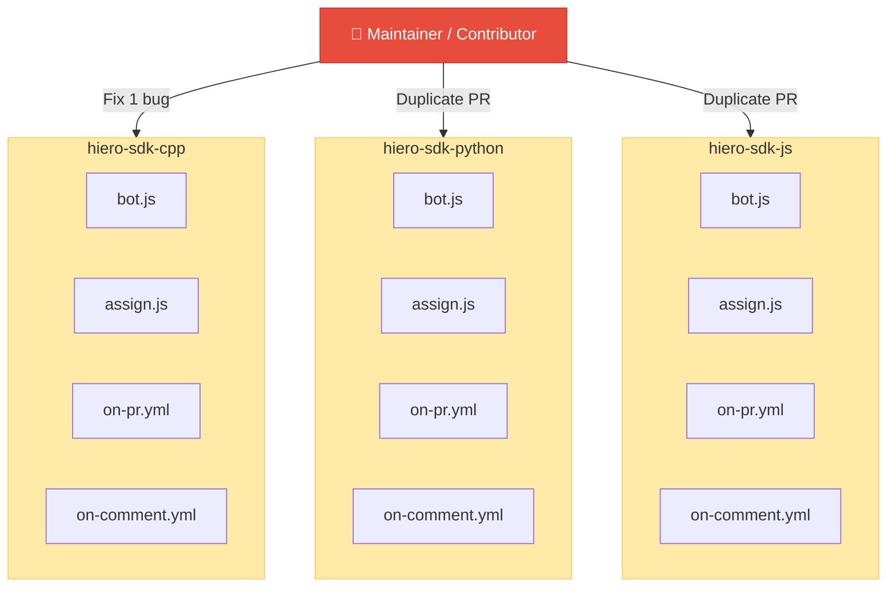
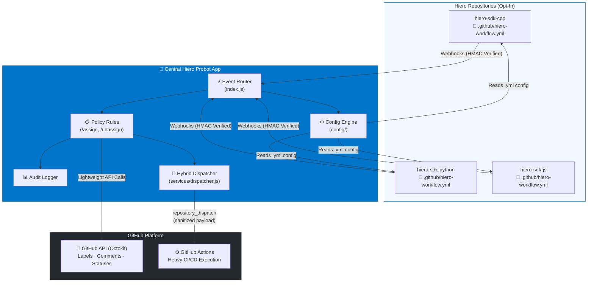
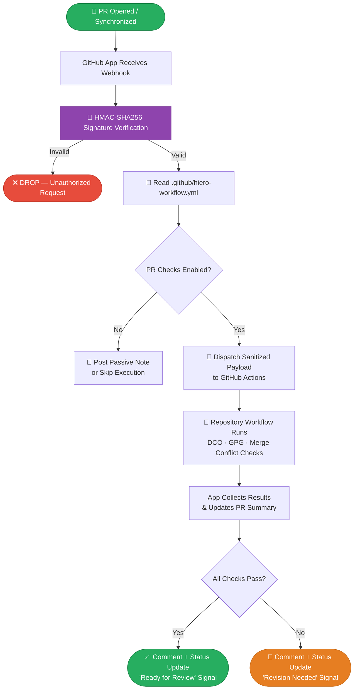
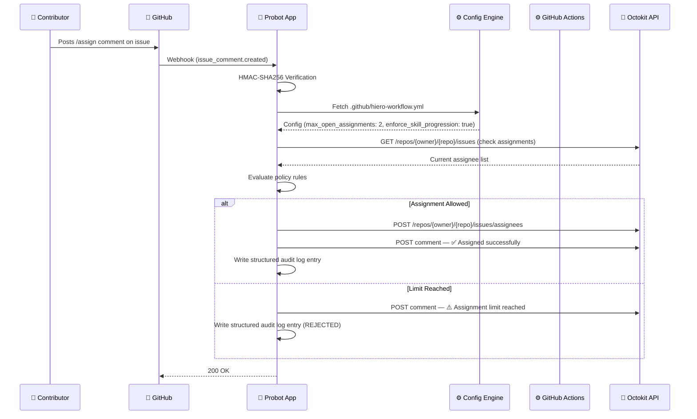
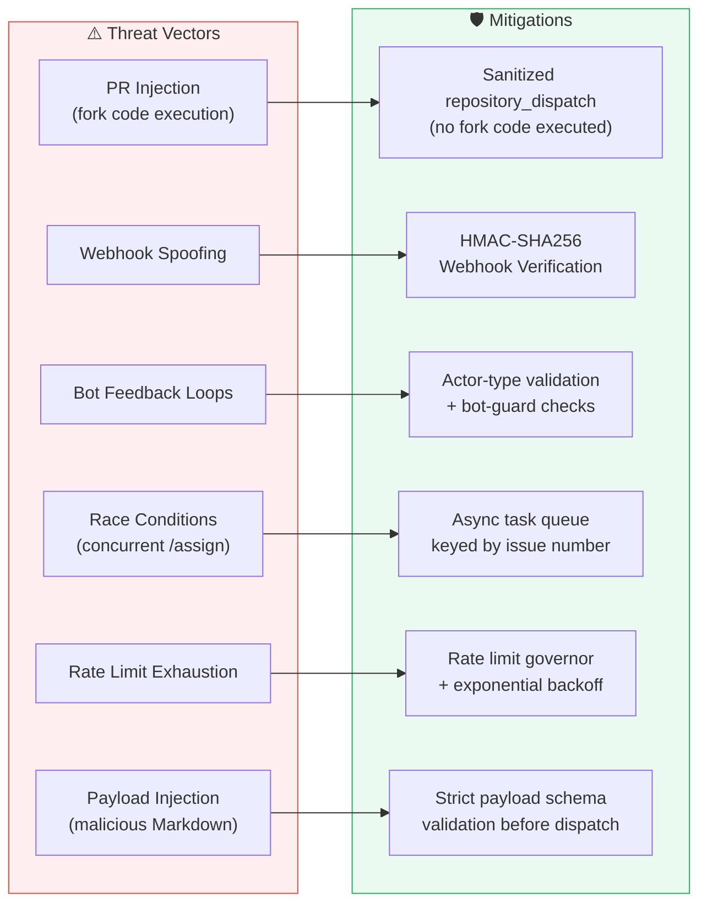
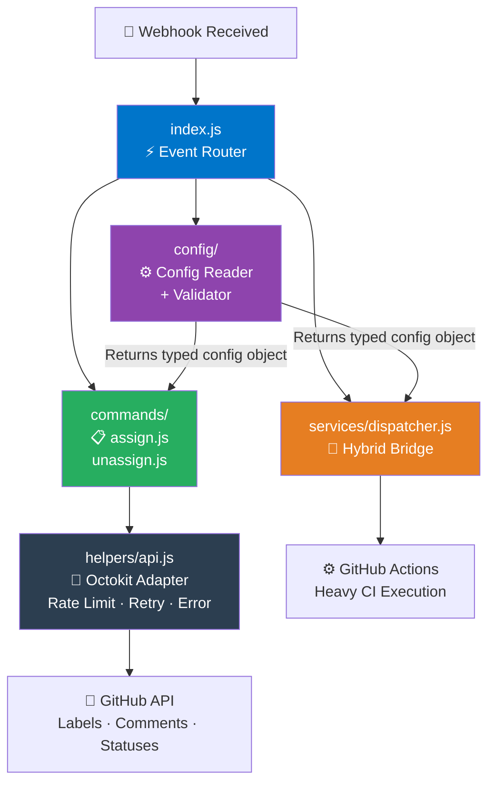
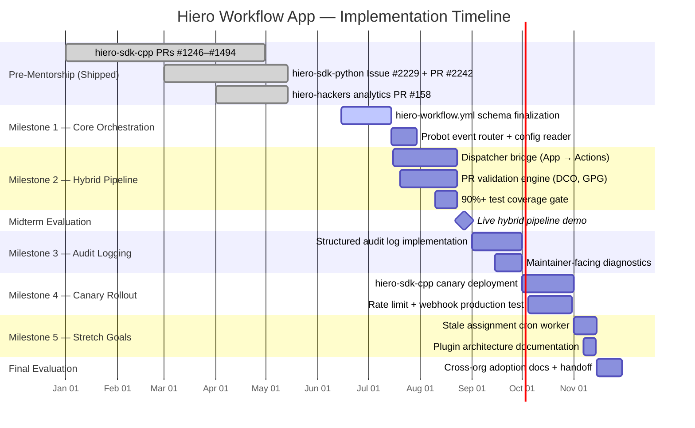
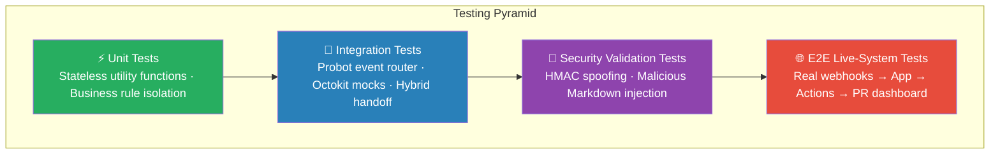
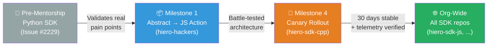

<div align="center">

<br/>
### **Centralized GitHub Workflow Orchestration for the Hiero Ecosystem**
#### *LF Decentralized Trust Mentorship Program — Issue #73*

<br/>

[](https://nodejs.org)
[](https://probot.github.io)
[](https://github.com/features/actions)
[](LICENSE)
[](https://mentorship.lfx.linuxfoundation.org)

[](https://github.com/darshit2308/sdk-automations)
[](https://github.com/darshit2308/sdk-automations)
[](https://github.com/darshit2308/sdk-automations)
[](https://github.com/darshit2308/sdk-automations)
[](https://github.com/darshit2308/sdk-automations/pulls)

<br/>

> **One PR to rule them all.** — Replace 12+ per-repository workflow PRs with a single,  
> centralized, cryptographically verified, audit-logged GitHub App.

<br/>

</div>

---

## 📋 Table of Contents

- [The Problem](#-the-problem)
- [The Solution — V2 Architecture](#-the-solution--v2-hybrid-architecture)
- [System Architecture](#-system-architecture)
  - [Current State: Fragmented Per-Repo](#current-state-fragmented-per-repo)
  - [Target State: Hybrid App Architecture](#target-state-hybrid-github-app-architecture)
  - [PR Validation Execution Flow](#pr-check-validation-pipeline)
  - [Event Routing Flow](#event-routing--decision-flow)
- [Core Features](#-core-features)
- [Security Model](#-security-model)
- [Configuration Reference](#-configuration-reference)
- [Project Structure](#-project-structure)
- [Implementation Milestones](#-implementation-milestones--roadmap)
- [Testing Strategy](#-testing-strategy)
- [Pre-Mentorship Contributions](#-pre-mentorship-contributions--proof-of-execution)
- [Getting Started](#-getting-started)
- [Local Development](#-local-development)
- [API & Dispatcher Reference](#-api--dispatcher-reference)
- [Audit & Observability](#-audit--observability)
- [Extensibility Guide](#-extensibility--plugin-architecture)
- [Rollout Strategy](#-rollout-strategy)
- [Learning Objectives](#-learning-objectives)
- [Author & Acknowledgements](#-author--acknowledgements)

---

## 🔥 The Problem

Hiero currently relies on a **decentralized pattern** of GitHub Actions and standalone JavaScript files to manage contributor workflows. This approach works for individual repositories — but breaks down catastrophically as the ecosystem scales.

```
Today: You fix one parsing bug.
Result: You open 12+ near-identical PRs across every SDK repository.
```

| Pain Point | Impact |
|---|---|
| Logic duplicated per-repository | High maintenance overhead |
| `pull_request_target` injection risk | Elevated CI security exposure |
| No unified audit trail | Opaque automation decisions |
| Feature toggles non-existent | Cannot adapt policy per-repo |
| Horizontal scaling | Linearly increasing coordination cost |

**The root issue isn't the automation. It's the architecture.**

---

## ✅ The Solution — V2 Hybrid Architecture

> **One centralized Probot GitHub App** for orchestration and policy enforcement, paired with **GitHub Actions** for isolated heavy execution.

```
Updating a core bot rule:
  Before → 12+ PRs across all repositories
  After  → 1 PR in the centralized service
```

**Measurable Success Criteria:**

| Metric | Target |
|---|---|
| Maintenance PRs per logic change | **1** (down from 12+) |
| CI uptime during canary phase | **≥ 99%** |
| Core orchestration test coverage | **≥ 90%** |
| Webhook events dropped | **0** |
| Legitimate maintainer merges blocked | **0** |

This proposal defines **V2** — a centralized GitHub App replacing per-repository execution with a single hybrid orchestration service.

| Version | Scope | Status |
|---|---|---|
| **V0** | Python SDK standalone scripts | Shipped |
| **V1** | C++ SDK refactored architecture | Shipped |
| **V2** | Centralized Hybrid GitHub App | **This project** |

---

## 🏗 System Architecture

### Current State: Fragmented Per-Repo



> ⚠️ A single logic fix requires **12+ near-identical pull requests** across repositories.

---

### Target State: Hybrid GitHub App Architecture



---

### PR Check Validation Pipeline



---

### Event Routing & Decision Flow



---

## ✨ Core Features

### 🤖 Issue Lifecycle Automation

| Command | Description | Permission Check |
|---|---|---|
| `/assign` | Self-assign an issue with cap enforcement | Skill-tier validation + open assignment limit |
| `/unassign` | Remove yourself from an issue | Issue state verification + label reversion |
| Auto stale | Cron-driven reassignment of inactive issues | Configurable `warning_days` + `auto_unassign_days` |

### 🔍 PR Validation Pipeline

| Check | Mechanism | Trigger |
|---|---|---|
| DCO sign-off | Dispatched GitHub Action | PR opened/synchronized |
| GPG signature | Dispatched GitHub Action | PR opened/synchronized |
| Merge conflict detection | App-level API check | PR synchronized |
| PR size warnings | App-level policy evaluation | PR opened/synchronized |
| Stale assignment detection | Cron scheduler | Configurable interval |

### 📊 Audit & Observability

- Every bot decision is logged with: `repository` · `trigger event` · `yml rule evaluated` · `final outcome`
- GitHub Check Runs integration for maintainer-facing PR dashboard
- Exportable structured logs per milestone for maintainer review

### 🔧 Per-Repository Configuration

All behavior driven by a single declarative YAML file — **no JavaScript changes needed** per repository.

---

## 🔒 Security Model

This architecture is designed with a **fail-closed security posture**. Every layer explicitly models and mitigates a distinct attack class.



### Security Boundary Definitions

**1. PR Injection Mitigation**

The App acts as a **secure airgap**. Fork webhook payloads are intercepted externally, evaluated in the isolated Node.js environment, and only **sanitized, explicitly defined parameters** are forwarded via `repository_dispatch`. No untrusted fork code ever executes with elevated privileges.

**2. Least-Privilege Permission Model**

```
✅ Issues: Read + Write          ← Required for /assign, /unassign
✅ Pull Requests: Read + Write   ← Required for PR validation pipeline
✅ Metadata: Read-only           ← Required for repo context
✅ Contents: Read-only           ← Required to fetch hiero-workflow.yml

❌ Repository secrets            ← Explicitly excluded
❌ Workflow administration       ← Explicitly excluded
❌ Direct code-write access      ← Explicitly excluded
```

Unlike PATs (which grant repository-wide write and represent a massive security liability), the GitHub App operates under **restrictive cryptographic bounds** minimizing blast radius in the event of any compromise.

**3. Cryptographic Webhook Verification**

Every incoming webhook is authenticated via **HMAC-SHA256** using a private webhook secret. Any request failing validation is **immediately dropped** before any processing occurs.

**4. Fail-Safe Degradation**

> If the App crashes or goes offline — **the repository does not lock**.

Human maintainers retain all native GitHub UI capabilities. The App only handles automation; it never gates critical repository operations.

**5. Non-Repudiation**

Centralized decision-making inherently generates a **unified, structured audit trail**. Every bot action records: `who triggered it` · `which yml rule applied` · `what the outcome was`.

---

## ⚙️ Configuration Reference

Each participating repository opts into automation via `.github/hiero-workflow.yml`. No JavaScript changes required.

```yaml
# .github/hiero-workflow.yml
# Full configuration reference for Hiero Workflow App

workflows:

  # ── Issue Assignment Automation ─────────────────────────────────────
  assign:
    enabled: true                      # Enable /assign and /unassign commands
    max_open_assignments: 2            # Maximum concurrent open issue assignments per user
    enforce_skill_progression: true    # Require GFI before medium; medium before hard
    needs_review_bypass: true          # Top contributors bypass assignment cap

  # ── PR Validation Pipeline ──────────────────────────────────────────
  pr_pipeline:
    require_dco: true                  # Enforce Developer Certificate of Origin
    require_gpg: true                  # Enforce GPG commit signing
    size_warnings_enabled: true        # Warn on oversized PRs
    size_warning_threshold: 500        # Lines changed threshold for size warning
    changes_requested_to_draft: true   # Auto-convert PR to draft on changes-requested

  # ── Stale Assignment Management ─────────────────────────────────────
  stale_assignments:
    enabled: true                      # Enable automatic stale assignment detection
    warning_days: 21                   # Days before posting inactivity warning
    auto_unassign_days: 28             # Days before automatic unassignment

  # ── Community Review Signals ─────────────────────────────────────────
  community_review:
    enabled: true                      # Post 'help-wanted: reviewer' on GFI/beginner PRs
    label: "help-wanted: reviewer"     # Label to apply

  # ── Audit & Observability ────────────────────────────────────────────
  audit:
    log_level: structured              # Options: structured | verbose | minimal
    retention_days: 90                 # Audit log retention window
    check_runs_enabled: true           # Post results to GitHub Check Runs dashboard
```

### Configuration Behavior Matrix

| Scenario | Behavior |
|---|---|
| Repository has no `hiero-workflow.yml` | Defaults to **warn-only** mode — logs telemetry, no state mutations |
| Feature toggle `enabled: false` | That capability is fully skipped — no API calls made |
| App offline / crashed | Repositories continue operating normally via native GitHub UI |
| Webhook HMAC fails | Request dropped immediately before any processing |

---

## 📁 Project Structure

```
sdk-automations/
│
├── 📄 action.yml                    # GitHub Action entrypoint (review-sync)
│
├── dist/                            # Compiled Action artifacts
│
├── packages/
│   ├── core/
│   │   └── src/
│   │       ├── 📄 index.js          # ⚡ Event Router — Probot entrypoint, webhook ingestion
│   │       │
│   │       ├── automations/
│   │       │   ├── review-sync/     # PR review queue synchronization logic
│   │       │   └── run-automation/  # Automation runner framework
│   │       │
│   │       ├── commands/
│   │       │   ├── assign.js        # /assign command — policy evaluation + API call
│   │       │   └── unassign.js      # /unassign command — state verification + reversion
│   │       │
│   │       ├── config/
│   │       │   └── index.js         # Config reader — fetches + validates hiero-workflow.yml
│   │       │
│   │       ├── services/
│   │       │   └── dispatcher.js    # 🌉 Hybrid Bridge — fires repository_dispatch to Actions
│   │       │
│   │       ├── helpers/
│   │       │   └── api.js           # Octokit adapter — rate limiting, retries, error handling
│   │       │
│   │       └── github/              # GitHub integration utilities
│   │
│   ├── github-action-adapter/       # Adapter layer bridging App ↔ Actions
│   ├── probot-app/                  # Probot App bootstrap + webhook server
│   └── schemas/
│       └── hiero-automation.schema.json   # JSON Schema for workflow config validation
│
├── docs/
│   ├── adrs/                        # Architecture Decision Records
│   │   ├── architecture.md
│   │   ├── caller-interface.md
│   │   ├── migration-plan.md
│   │   └── stepsecurity.md
│   └── examples/
│       ├── hiero-sdk-cpp/           # Example integration for C++ SDK
│       └── hiero-sdk-python/        # Example integration for Python SDK
│
├── tests/
│   ├── config.test.js               # Config reader unit tests
│   ├── review-sync.test.js          # Review sync integration tests
│   └── test-utils.js                # Shared test utilities + mock factories
│
├── .github/
│   └── workflows/
│       └── ci.yml                   # CI pipeline — lint, test, coverage gate
│
├── package.json
├── package-lock.json
└── README.md
```

### Module Responsibility Boundaries



---

## 🗺 Implementation Milestones & Roadmap



### Milestone Deliverables

| Phase | Timeline | Deliverable |
|---|---|---|
| **M1** — Core Orchestration | Jun 15 – Jul 15 | App reads `.github/hiero-workflow.yml` per repo; feature toggles parse correctly |
| **M2** — Hybrid Pipeline | Jul 16 – Aug 23 | Dispatcher bridge functional; PR validation end-to-end with **≥ 90% test coverage** |
| **Midterm** | Aug 24 – 31 | Live demo of hybrid PR pipeline in `hiero-hackers` sandbox |
| **M3** — Audit Logging | Sep 1 – 30 | Transparent, queryable audit trails fully operational |
| **M4** — Canary Rollout | Oct 1 – 31 | App runs safely on `hiero-sdk-cpp` for 30 days without dropping events or blocking PRs |
| **M5** — Stretch Goals | Nov 1 – 14 | Stale-issue sweeper + documented plugin extension architecture |
| **Final** | Nov 15 – 30 | Cross-organization adoption guides + maintainer handoff documentation |

### Mapping to Issue #73 Requirements

| Requirement | Delivered In |
|---|---|
| Reusable GitHub App for maintainer workflows | M1 + M2 (core Probot service + hybrid dispatcher) |
| Configurable per-repository feature toggles | M1 (dynamic YAML reader — no code changes per repo) |
| Tests covering core logic + safety constraints | M2 + M4 (TDD + live canary) |
| Documentation for maintainers and contributors | Final phase |
| Extension hooks for future workflows | M5 (documented integration boundaries) |

---

## 🧪 Testing Strategy

> *"Safety and testing are perhaps the most important part of this initiative."*

This project is developed under strict **Test-Driven Development (TDD)** with a layered validation matrix.



### Test Layer Definitions

**Unit Tests (Pure Logic)**
- Validates stateless functions in `checks.js` — skill-tier prerequisites, PR size limits
- Zero mocked network requests — pure deterministic evaluation
- Target: **100% coverage** of all state-mutation utility functions

**Integration Tests (The Hybrid Bridge)**
- Tests Probot event router and Octokit adapters using mocked GitHub payloads via `nock`
- Critically verifies the **Hybrid Handoff** — that `repository_dispatch` fires with correct sanitized parameters

**Failure-Path & Chaos Matrix**
```
✅ Octokit API timeout simulation
✅ GitHub rate-limit rejection simulation
✅ Race condition simulation (3 concurrent /assign commands)
✅ Async queue collision handling verification
```

**Security Validation**
```
✅ Spoofed webhook → HMAC-SHA256 rejection
✅ Malicious Markdown in comments → payload sanitization before dispatch
✅ Oversized payload → schema validation rejection
```

**E2E Live-System Validation**
- End-to-end tests against live `hiero-hackers` sandbox
- Full lifecycle: real webhook → centralized App → live GitHub Action → PR dashboard comment

### Quality Gates

```yaml
# .github/workflows/ci.yml — enforced on every PR
- name: Coverage Enforcement
  run: |
    # Blocks any PR that drops core coverage below 90%
    npx jest --coverage --coverageThreshold='{"global":{"branches":90,"functions":90,"lines":90}}'

- name: Architect Review Required
  # Mandatory LFDT mentor approval for:
  # - Changes to core Probot routing logic
  # - GitHub Actions dispatch payloads
  # - Security boundary modifications
```

---

## 🏆 Pre-Mentorship Contributions — Proof of Execution

> **Extensive ecosystem familiarity before the formal program starts.**

### Hiero C++ SDK — Automation Hardening

| PR | Title | Status | What It Proves |
|---|---|---|---|
| [#1246](https://github.com/hiero-ledger/hiero-sdk-cpp/pull/1246) | `/unassign` command implementation | ✅ Merged | Permission validation, issue state verification, automated label reversion, unit tests |
| [#1365](https://github.com/hiero-ledger/hiero-sdk-cpp/pull/1365) | TOCTOU race condition removal | ✅ Merged | Race-condition hardening in live CI/CD automation |
| [#1409](https://github.com/hiero-ledger/hiero-sdk-cpp/pull/1409) | Stale label revalidation before assignment | ✅ Merged | Prevention of stale-assignment race conditions |
| [#1468](https://github.com/hiero-ledger/hiero-sdk-cpp/pull/1468) | Remove `kind` label requirement | ✅ Merged | Reduced contributor friction without breaking backward compatibility |
| [#1494](https://github.com/hiero-ledger/hiero-sdk-cpp/pull/1494) | `needs-review` bypass for top contributors | ✅ Merged | Assignment-cap bypass to unblock high-velocity contributors |

### Protocol Correctness & Distributed Systems

| PR | Repository | Status | What It Proves |
|---|---|---|---|
| [#57](https://github.com/hiero-ledger/hiero-did-sdk-js/pull/57) | `hiero-did-sdk-js` | ✅ Merged | Hedera mirror node timeout diagnostics, distributed systems debugging |
| [#22](https://github.com/hiero-platform/heka-identity-platform/pull/22) | `heka-identity-platform` | ✅ Merged | OID4VCI credential flow correctness, Heka codebase depth |
| [#25](https://github.com/hiero-platform/heka-identity-platform/pull/25) | `heka-identity-platform` | ✅ Merged | Production API correctness fixes |
| [#69](https://github.com/hiero-platform/heka-identity-platform/pull/69) | `heka-identity-platform` | 🔄 Open | Wallet DID persistence + Admin wallet ID alignment |

### Ecosystem Analytics & Pre-Mentorship Python SDK Work

| Contribution | Repository | Status | What It Proves |
|---|---|---|---|
| [PR #158](https://github.com/hiero-hackers/analytics/pull/158) | `hiero-hackers/analytics` | ✅ Merged | Maintainer telemetry, issue-creation activity signals |
| [Issue #2229](https://github.com/hiero-ledger/hiero-sdk-python/issues/2229) | `hiero-sdk-python` | 📋 Active | Architectural proposal — 4-phase review queue automation |
| [PR #2242](https://github.com/hiero-ledger/hiero-sdk-python/pull/2242) | `hiero-sdk-python` | 🔄 Open | Phase 1 — Foundation + Label Sync implementation |
| [PR #2254](https://github.com/hiero-ledger/hiero-sdk-python/pull/2254) | `hiero-sdk-python` | 🔄 Open | Phase 2 — Difficulty-based routing |
| [PR #2262](https://github.com/hiero-ledger/hiero-sdk-python/pull/2262) | `hiero-sdk-python` | 🔄 Open | Phase 3 — Assignment + comment automation |

### Exploratory Prototypes (Research Phase)

| Prototype | Focus | Key Findings |
|---|---|---|
| [`hiero-workflow-probot`](https://github.com/darshit2308/hiero-workflow-probot) | Orchestration + Dynamic Configuration | Repository-level `.yml` config can drive centralized behavior; App correctly parses feature toggles per repository |
| [`heiro-probot-official`](https://github.com/darshit2308/heiro-probot-official) | Porting Hiero's Business Logic | Hiero's C++ SDK `/assign` + `/unassign` routines — including skill-tier checks and assignment limits — successfully operate entirely through the Octokit API outside of GitHub Actions |

---

## 🚀 Getting Started

### Prerequisites

```bash
node --version   # Requires Node.js 18+
npm --version    # Requires npm 8+
```

### Installation

```bash
# Clone the repository
git clone https://github.com/darshit2308/sdk-automations.git
cd sdk-automations

# Install dependencies
npm install

# Copy environment template
cp .env.example .env
```

### Environment Configuration

```env
# .env
APP_ID=<your-github-app-id>
PRIVATE_KEY=<your-github-app-private-key>
WEBHOOK_SECRET=<your-hmac-webhook-secret>
GITHUB_CLIENT_ID=<your-github-client-id>
GITHUB_CLIENT_SECRET=<your-github-client-secret>

# Optional
LOG_LEVEL=info
NODE_ENV=development
```

### Repository Opt-In

Add `.github/hiero-workflow.yml` to any repository you want the App to manage (see [Configuration Reference](#-configuration-reference)).

---

## 💻 Local Development

```bash
# Start the Probot App locally (with webhook tunnel via smee.io)
npm run dev

# Run the full test suite
npm test

# Run tests with coverage report
npm run test:coverage

# Run only unit tests
npm run test:unit

# Run only integration tests
npm run test:integration

# Lint the codebase
npm run lint

# Build the GitHub Action (dist/)
npm run build
```

### Testing Against a Live Repository

```bash
# 1. Create a smee.io channel for local webhook forwarding
npx smee-client --url https://smee.io/<your-channel> --target http://localhost:3000/

# 2. Configure your GitHub App's webhook URL to point to your smee channel

# 3. Start the dev server
npm run dev

# 4. Trigger events in your test repository and observe live routing
```

---

## 📡 API & Dispatcher Reference

### Supported Webhook Events

| Event | Action | Handler |
|---|---|---|
| `issue_comment` | `created` | Parses `/assign`, `/unassign` commands |
| `pull_request` | `opened`, `synchronize` | Triggers PR validation pipeline |
| `pull_request_review` | `submitted` | Handles `changes_requested_to_draft` |
| `schedule` (cron) | — | Stale assignment detection sweep |

### Dispatcher Payload Schema

When dispatching to GitHub Actions, only sanitized parameters are forwarded:

```javascript
// services/dispatcher.js
await octokit.repos.createDispatchEvent({
  owner,
  repo,
  event_type: 'hiero-workflow-pr-check',
  client_payload: {
    pr_number: payload.pull_request.number,   // integer — validated
    sha: payload.pull_request.head.sha,       // string — sha format validated
    checks: {
      require_dco: config.pr_pipeline.require_dco,
      require_gpg: config.pr_pipeline.require_gpg,
    }
    // ⛔ No raw fork content — no untrusted code — no elevated secrets
  }
})
```

### Standard Response Format

All validation gates return a strictly typed object:

```typescript
interface ValidationResult {
  success: boolean;
  data?: Record<string, unknown>;
  error?: {
    code: string;
    message: string;
    context?: Record<string, unknown>;
  };
}
```

---

## 📊 Audit & Observability

Every bot action generates a structured log entry:

```json
{
  "timestamp": "2026-09-15T10:32:41.123Z",
  "event_type": "issue_comment.assign",
  "repository": "hiero-ledger/hiero-sdk-cpp",
  "actor": "contributor-username",
  "issue_number": 1042,
  "rule_evaluated": "assign.max_open_assignments",
  "rule_value": 2,
  "current_count": 2,
  "outcome": "REJECTED",
  "reason": "Assignment limit reached",
  "action_taken": "Posted informative comment — no state mutation"
}
```

Audit entries are recorded via:
- **GitHub Check Runs** — visible on every PR dashboard
- **Structured log stream** — queryable per repository and per time range
- **Administrative repository** — centralized audit archive for LFDT maintainers

---

## 🔌 Extensibility & Plugin Architecture

New capabilities are added as **isolated event subscribers** — the core routing logic is never modified.

```javascript
// Adding a new capability — example: auto-milestone tracking
// packages/core/src/automations/milestone-tracker/index.js

module.exports = (app) => {
  // Subscribe to the relevant event — isolated from all other modules
  app.on('pull_request.labeled', async (context) => {
    const config = await getConfig(context)
    if (!config.milestone_tracking?.enabled) return

    // Implementation isolated here — cannot affect /assign or /unassign
    await handleMilestoneSync(context, config)
  })
}

// Register in index.js — one line, zero changes to existing modules
require('./automations/milestone-tracker')(app)
```

### Architectural Tradeoffs Considered

| Alternative | Why Rejected |
|---|---|
| **Reusable Workflows** | `workflow_call` cannot auto-checkout shared scripts from a centralized repo; retains `pull_request_target` injection risk; no persistent state |
| **Monolithic Probot Server** | Anti-pattern at Hiero's scale — no isolation between compute-heavy and lightweight tasks |
| **GitMesh / OPA** | Excellent for AI governance; overkill for V2's deterministic compliance layer (DCO, GPG, assignment limits require 100% reliability first) |
| **Hybrid App + Actions** ✅ | Centralized policy, isolated execution, lightweight server, leverages GitHub's native CI infrastructure |

---

## 📦 Rollout Strategy



| Phase | Repository | Enforcement Mode | Success Gate |
|---|---|---|---|
| Pre-Mentorship | `hiero-sdk-python` | Active (Phase 1) | PR #2242 merged |
| Milestone 1–2 | `hiero-hackers` sandbox | Warn-only → Active | Hybrid pipeline E2E passing |
| Milestone 4 | `hiero-sdk-cpp` canary | Active | 30 days · zero dropped webhooks · zero blocked PRs |
| Post-M4 | `hiero-sdk-js` and others | Active | Telemetry + maintainer sign-off |

> **New repository integrations default to `warn-only` mode** — logs telemetry but performs zero state mutations until a maintainer explicitly enables active mode.

---

## 🎓 Learning Objectives

This mentorship represents a deliberate transition from **MVP-grade** to **production-grade** infrastructure engineering.

| Area | Specific Learning Goal |
|---|---|
| **Production Security** | Model threat vectors for webhook payloads and PR injection attacks the way experienced maintainers do |
| **The Production Delta** | Understand the gap between "good enough for one PR" and "good enough for an entire organization's production environment" |
| **Graceful Degradation** | Design systems where a crash never blocks repository operations |
| **API Rate Management** | Master exponential backoff, concurrency limits, and rate-limit governors in high-traffic conditions |
| **Transparent Auditability** | Architect systems where every automated decision is verifiable by human maintainers without digging through logs |
| **Canary Rollout** | Gain hands-on experience safely distributing architectural changes across legacy repositories |

### Communication Cadence

| Channel | Frequency | Purpose |
|---|---|---|
| Discord | Daily | Rapid synchronization, blockers, quick questions |
| GitHub Draft PRs | Continuous | Async visibility into development cycles |
| Issue Comments | Per decision | Architecture decisions documented in-thread |
| Email / Formal Report | End-of-milestone | Structured evaluation with recorded demos |
| Bi-weekly sync | Every 2 weeks | Collaborative review with mentor |

---

## 🌍 Broader Vision

This solution is explicitly designed for Hiero's immediate pain points — but the broader ambition is clear:

> **A highly configurable, cryptographically secure, audit-logged workflow engine that could optionally serve the entire LF Decentralized Trust ecosystem.**

This mentorship is not a finite three-month project. It is **the onboarding phase for long-term maintainership**. Post-program, I am committed to:

- Maintaining the centralized workflow service actively
- Preserving the `hiero-hackers` sandbox environment
- Supporting broader LFDT integration as the organization scales
- Documenting and mentoring future contributors on the architecture

---

## 👤 Author & Acknowledgements

<div align="center">

**Darshit Khandelwal**

[](https://github.com/darshit2308)
[](mailto:darshit2308@gmail.com)
[-0052CC?style=for-the-badge)](https://time.is/IST)

*IIIT Gwalior · Available ~20–25 hrs/week · Full coding period*

</div>

**Applying for:** [Hiero: GitHub Workflow App — LFDT Mentorship Issue #73](https://github.com/hiero-ledger/hiero/issues/73)

**Addressed to:** Sophie Bulloch (`exploreriii`) — LF Decentralized Trust

---

**Special thanks** to the Hiero maintainers and the LF Decentralized Trust community for the open discussions around Issue #73 that shaped this architectural proposal. The `hiero-sdk-cpp` codebase, in particular, provided the real-world constraints that grounded this design in practice over theory.

---

<div align="center">

*Built for Hiero. Designed for the entire LFDT ecosystem.*

[](https://mentorship.lfx.linuxfoundation.org)

</div>
